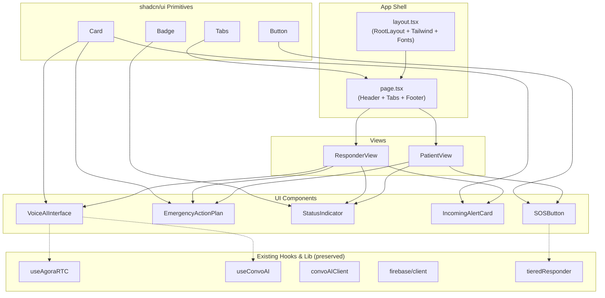

# Design Document: First Aid Bot UI

## Overview

This design describes the complete UI rebuild of the First Aid Bot emergency response application. The existing Next.js scaffold (with Agora RTC hooks, Firebase, and API routes) will be preserved. The UI layer will be replaced with a mobile-first, dark-themed emergency interface using Tailwind CSS v4, shadcn/ui, and Lucide React icons. The app features a dual-view (Patient/Responder) tabbed interface with an SOS trigger, Emergency Action Plan cards, voice AI integration UI, and incoming alert workflow.

The project root for all file paths is: `submissions/Group B/Chilimansi/Source Code/voice-ai-agent/`

## Architecture



### Key Decisions

1. **Preserve existing hooks/lib**: `useAgoraRTC`, `useConvoAI`, `convoAIClient`, `firebase/client`, and `tieredResponder` remain unchanged. The new UI components will import from them.
2. **Replace page and components entirely**: `page.tsx`, `page.module.css`, `globals.css`, `layout.tsx`, `GeoResponderMap.tsx`, and `WearableTriggerSimulator.tsx` will be rewritten or replaced.
3. **Tailwind CSS v4**: Installed via `@tailwindcss/postcss`. Theme tokens defined in `app/globals.css` using `@theme` directive with oklch colors.
4. **shadcn/ui**: Only the needed primitives (Card, Tabs, Button, Badge) will be added. Using the `new-york` style with manual file creation under `src/components/ui/`.
5. **No additional state management**: React `useState` at the page level is sufficient for the demo workflow. No context providers or external state libraries needed.

## Components and Interfaces

### File Structure (new/modified files only)

```
src/
├── app/
│   ├── globals.css          (rewritten — Tailwind v4 + theme tokens + animations)
│   ├── layout.tsx           (modified — add Tailwind, update metadata)
│   └── page.tsx             (rewritten — header, tabs, footer, state management)
├── components/
│   ├── ui/
│   │   ├── card.tsx         (shadcn Card primitive)
│   │   ├── tabs.tsx         (shadcn Tabs primitive)
│   │   ├── button.tsx       (shadcn Button primitive)
│   │   └── badge.tsx        (shadcn Badge primitive)
│   ├── sos-button.tsx
│   ├── emergency-action-plan.tsx
│   ├── status-indicator.tsx
│   ├── incoming-alert-card.tsx
│   ├── voice-ai-interface.tsx
│   ├── patient-view.tsx
│   └── responder-view.tsx
├── lib/
│   └── utils.ts             (cn utility for className merging)
```

### Component Specifications

#### `page.tsx` (Main Page)
- Client component (`"use client"`)
- State: `activeTab` ("patient" | "responder"), `emergencyState` ("idle" | "alerting"), `responderState` ("waiting" | "alert-received" | "responding"), `voiceAIConnected` (boolean), `isMuted` (boolean)
- Renders: sticky header, `<Tabs>` with Patient/Responder panels, footer
- Passes state + callbacks down to views as props

#### `sos-button.tsx`
- Props: `isAlerting: boolean`, `onTrigger: () => void`
- 192×192px circle, red bg, AlertTriangle + "SOS" + "TULONG!"
- `pulse-emergency` animation when `!isAlerting`
- Disabled when `isAlerting`
- Helper text changes based on state
- `aria-label="Emergency SOS button"`

#### `emergency-action-plan.tsx`
- Props: `condition: string`, `actionRequired: string`, `emergencyContact: string`, `compact?: boolean`
- Uses `<Card>` from shadcn
- FileText icon header, condition with warning color, phone with success color
- Compact mode reduces padding and font sizes

#### `status-indicator.tsx`
- Props: `status: "idle" | "alerting" | "connected" | "offline"`
- Uses `<Badge>` variant styling
- Icon + text changes per status
- `role="status"` + `aria-live="polite"`

#### `incoming-alert-card.tsx`
- Props: `patient: { name, avatar, location, distance, time, condition }`, `onAccept: () => void`, `onDecline: () => void`
- `<Card>` with red-tinted left border
- Info grid layout, URGENT badge, two action buttons

#### `voice-ai-interface.tsx`
- Props: `isConnected: boolean`, `isMuted: boolean`, `onConnect: () => void`, `onDisconnect: () => void`, `onToggleMute: () => void`
- Disconnected: green "Connect to Voice AI (Agora)" button
- Connected: card with "Voice AI Active", 8-bar audio visualizer, mute toggle, red "End Call"
- Audio bars use `audio-wave` animation with staggered `animation-delay`

#### `patient-view.tsx`
- Props: `emergencyState`, `onSOSTrigger`, `status`
- Centered vertical layout: StatusIndicator → SOSButton → EAP → location text
- Comments for Supabase integration

#### `responder-view.tsx`
- Props: `responderState`, `voiceAIConnected`, `isMuted`, `onAcceptAlert`, `onDeclineAlert`, `onConnectVoice`, `onDisconnectVoice`, `onToggleMute`, `onMarkComplete`
- Three states: waiting (shield + standby), alert-received (IncomingAlertCard), responding (nav card + compact EAP + VoiceAI + Mark Complete)
- 2-second simulated alert delay handled in page.tsx

### shadcn/ui Primitives

Each primitive will be a minimal implementation following shadcn/ui patterns with `class-variance-authority` for variants and the `cn()` utility.

- **Card**: `Card`, `CardHeader`, `CardTitle`, `CardDescription`, `CardContent`, `CardFooter`
- **Tabs**: `Tabs`, `TabsList`, `TabsTrigger`, `TabsContent`
- **Button**: variants `default`, `destructive`, `outline`, `success`, `ghost`; sizes `default`, `sm`, `lg`, `icon`
- **Badge**: variants `default`, `destructive`, `outline`, `success`, `warning`

## Data Models

No persistent data models are introduced. All state is ephemeral React state for the demo. The existing Firebase/Firestore models in `lib/firebase/client.ts` and `lib/geolocation/tieredResponder.ts` remain unchanged.

### Demo Data (hardcoded in page.tsx)

```typescript
const demoPatient = {
  name: "Juan D.",
  avatar: "JD",
  location: "BGC Taguig",
  distance: "150m",
  time: "Just now",
  condition: "Severe Asthma",
};

const demoEAP = {
  condition: "Severe Asthma",
  actionRequired: "Inhaler is in my front right pocket. If unconscious, call 143 or 911 immediately.",
  emergencyContact: "143 (Red Cross)",
};
```

## Error Handling

- SOS button is disabled during alerting state to prevent double-triggers.
- Voice AI connect/disconnect buttons are conditionally rendered based on connection state.
- All async operations from existing hooks (`useAgoraRTC`, `useConvoAI`) already handle errors via try/catch in their respective implementations.
- The UI gracefully degrades: if voice AI fails to connect, the button remains in disconnected state.
- No new error boundaries are needed for this UI-only rebuild.

## Testing Strategy

- Visual verification of all component states (idle, alerting, connected, etc.) via manual browser testing on mobile viewport (375px).
- Verify tab switching renders correct views.
- Verify SOS button state transitions and animation toggling.
- Verify responder workflow: waiting → alert-received (2s delay) → responding → complete.
- Verify voice AI interface: connect → visualizer + mute toggle → end call.
- Accessibility audit: check ARIA labels, role="status", aria-live, aria-hidden on decorative icons using browser dev tools.
- Keyboard navigation: verify all interactive elements are focusable and operable via keyboard.

## Theme Configuration

The Tailwind CSS v4 theme will be defined in `globals.css` using the `@theme` directive:

```css
@import "tailwindcss";

@theme {
  --color-background: oklch(0.13 0.005 260);
  --color-foreground: oklch(0.98 0 0);
  --color-card: oklch(0.18 0.005 260);
  --color-card-foreground: oklch(0.98 0 0);
  --color-destructive: oklch(0.55 0.22 25);
  --color-success: oklch(0.65 0.18 145);
  --color-warning: oklch(0.75 0.15 85);
  --color-muted: oklch(0.65 0 0);
  --color-muted-foreground: oklch(0.65 0 0);
  --color-border: oklch(0.28 0.005 260);
  --color-primary: oklch(0.55 0.22 25);
  --color-primary-foreground: oklch(0.98 0 0);
  --color-secondary: oklch(0.22 0.005 260);
  --color-secondary-foreground: oklch(0.98 0 0);
  --color-accent: oklch(0.22 0.005 260);
  --color-accent-foreground: oklch(0.98 0 0);
  --color-ring: oklch(0.55 0.22 25);
  --radius: 0.75rem;
}

@keyframes pulse-emergency {
  0%, 100% { box-shadow: 0 0 0 0 oklch(0.55 0.22 25 / 0.7); }
  50% { box-shadow: 0 0 0 20px oklch(0.55 0.22 25 / 0); }
}

@keyframes audio-wave {
  0%, 100% { transform: scaleY(0.3); }
  50% { transform: scaleY(1); }
}
```

## Dependencies to Install

- `tailwindcss` (v4)
- `@tailwindcss/postcss`
- `class-variance-authority`
- `clsx`
- `tailwind-merge`
- `lucide-react`
- `@radix-ui/react-tabs` (for shadcn Tabs)
- `@radix-ui/react-slot` (for shadcn Button asChild)

The existing `agora-rtc-sdk-ng`, `firebase`, `next`, `next-pwa`, `react`, `react-dom` dependencies remain.
